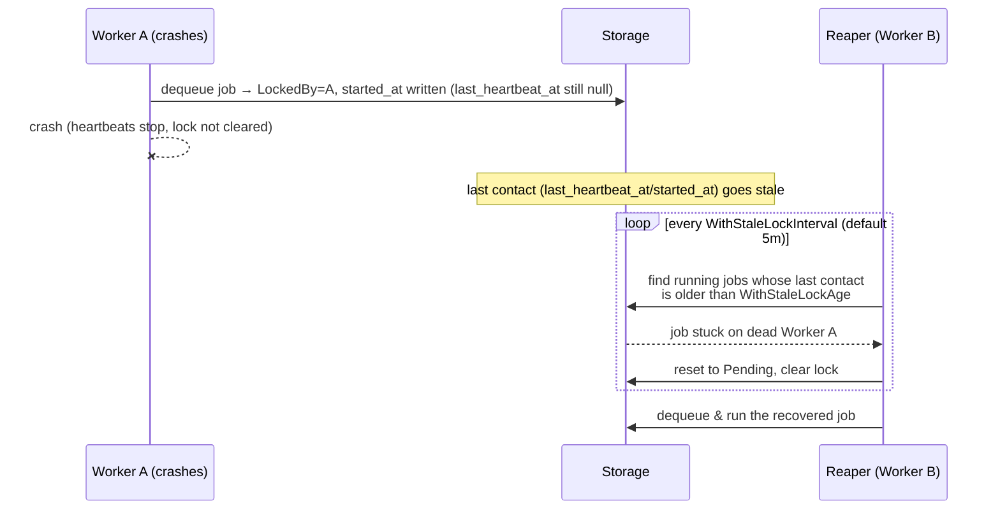

When a worker crashes mid-job, the job stays in "running" status with no one to
complete or fail it. The stale lock reaper is a background mechanism that detects
these abandoned jobs and resets them so another worker can pick them up.



## How Job Locking Works

Every time a worker dequeues a job, it acquires an exclusive lock on the job
record in the database:

1. The storage layer sets `LockedBy` to the worker's unique ID, records
   `started_at`, and sets `LockedUntil` to 45 minutes from now.
2. While the job is executing, the worker sends a **heartbeat** that refreshes
   `last_heartbeat_at` (and pushes `LockedUntil` out by another 45 minutes). The
   heartbeat is what proves the worker is still alive; `last_heartbeat_at` is the
   live "last contact" timestamp the reaper checks.
3. When the job completes or fails, the worker clears the lock fields.

If a worker crashes before it can clear the lock, its heartbeats stop. Its last
contact (`last_heartbeat_at`, or `started_at` if it crashed before the first
heartbeat) stops advancing, and once that timestamp falls more than
`StaleLockAge` behind the current time the job becomes reclaimable — even if the
stacked `LockedUntil` lease is still in the future.

## The Stale Lock Reaper

Each worker starts a background goroutine called the stale lock reaper. It
performs the following cycle:

1. **Tick** -- wake up on a configurable interval (default: every 5 minutes).
2. **Scan** -- query the database for jobs whose `status` is `running` and whose
   *last contact* is older than the current time minus `StaleLockAge` (default:
   45 minutes). Last contact is `COALESCE(last_heartbeat_at, started_at,
   locked_until)`: the most recent moment the owning worker was demonstrably
   alive, **not** the lease expiry. A job is therefore reclaimable as soon as the
   owner has been silent for `StaleLockAge`, even if `LockedUntil` is still in the
   future.
3. **Reset** -- set those jobs back to `pending`, clear `LockedBy` and
   `LockedUntil`, so another worker can dequeue them.
4. **Signal** -- for each reclaimed job ID the reaper emits a `JobReclaimed`
   event (`Reason = stale_lock`), fires the registered `OnJobReclaimed` hooks,
   and logs a structured line:

```
INFO released stale running jobs count=N cancelled_locally=M
```

Because every worker runs its own reaper, the cluster self-heals even if only
one worker remains online.

### Observability

Stale-lock reclaims are a crash leading-indicator, so they are surfaced through
the event/hook/metric pipeline — not just `slog` — and are fully alertable:

- **Event** -- each reclaimed job ID produces a `JobReclaimed` event carrying
  `JobID`, `WorkerID`, `Reason` (`stale_lock` for the reaper) and `Timestamp`.
  See the [Events reference]() for the
  full type and the `stale_lock` vs `ownership_audit` distinction.
- **Hook** -- register `queue.OnJobReclaimed(func(ctx, jobID, reason string))`
  to react per reclaimed job (page, increment your own counter, etc.).
- **Metric** -- `jobs.metrics.Instrument` auto-wires the hook into the
  `jobs.leases.reclaimed` counter, labelled by `reason`. See the
  [Metrics catalog](). Do not sum across
  `reason` values: in a multi-process fleet the same logical reclaim can be
  observed once as `stale_lock` (the reaper) and once as `ownership_audit` (the
  victim worker).

## Configuration

Both tuning knobs are set through worker options:

```go
worker := queue.NewWorker(
    jobs.WithStaleLockInterval(5 * time.Minute), // How often to check (default: 5min)
    jobs.WithStaleLockAge(45 * time.Minute),      // Max silence before reclaim (default: 45min)
)
```

### Disabling the Reaper

If you run a single worker and prefer to handle stale jobs through external
monitoring, you can disable the reaper entirely:

```go
worker := queue.NewWorker(
    jobs.WithStaleLockInterval(0), // Disable the stale lock reaper
)
```

### Choosing Values

| Parameter | Default | Guidance |
|-----------|---------|----------|
| `WithStaleLockInterval` | 5 min | Lower values detect stale jobs faster but add more database queries. For high-throughput clusters, 2-3 minutes is reasonable. |
| `WithStaleLockAge` | 45 min | How long the owning worker may be silent (send no heartbeat) before its job is reclaimed. This directly sets your post-crash recovery latency — a smaller value reclaims abandoned jobs faster. A live worker refreshes `last_heartbeat_at` several times per window, so an active job is never falsely reclaimed (see below); lower it freely if you want faster crash recovery. |

A live worker refreshes `last_heartbeat_at` several times within every
`StaleLockAge` window — the heartbeat interval is auto-clamped to
`StaleLockAge/3` (with a 200ms floor), so roughly three heartbeats land before
the stale window could elapse. An active job's last-contact timestamp therefore
stays well inside the window and is never reclaimed. Because reclaim now anchors
on last contact rather than lease expiry, `StaleLockAge` sets post-crash reclaim
latency *directly* (≈ time since last contact), not `lockDuration + StaleLockAge`.

## When the Reaper Helps

The reaper is your safety net against several failure modes:

- **Worker process crash or SIGKILL** -- the process is gone, no cleanup runs
  and heartbeats stop. Once last contact ages past `StaleLockAge` the reaper
  resets the job.
- **Network partition between worker and database** -- the worker cannot send
  heartbeats, so last contact goes stale. Once the partition heals, the reaper
  (running on any healthy worker) reclaims the job.
- **Long GC pause or resource starvation** -- if a worker is paused by the
  operating system long enough to stop heartbeating for more than `StaleLockAge`,
  the reaper on a different worker can reclaim the job.

In all of these cases the job returns to `pending` status and will be retried by
the next available worker, preserving any checkpoints that were saved before the
failure.

## Interaction with Heartbeats and Retries

The heartbeat, lock, and reaper work together as a layered reliability
mechanism:

```
Heartbeat interval:  min(2 min, StaleLockAge/3), 200ms floor  (refreshes last contact)
Lock duration:       45 min  (initial lease; pushed out on each heartbeat)
Reaper age:          45 min  (how long since last contact before reclaim)
Reaper interval:     5 min   (how often we check)
```

The heartbeat interval is no longer a fixed 2 minutes: it is clamped to
`min(2m, StaleLockAge/3)` with a 200ms floor (`worker.go`). At the default
`StaleLockAge` of 45 minutes it stays at 2 minutes (45m / 3 = 15m > 2m); if you
shrink `StaleLockAge` it tightens automatically so several heartbeats always land
within the window. This clamp is precisely what makes last-contact reclaim safe:
because a live worker is guaranteed to refresh `last_heartbeat_at` (or, before
its first beat, has a recent `started_at`) well inside the window, the reaper can
never reclaim a job whose owner is still alive but has simply not heartbeated
recently.

A job can only be reclaimed if **both** of the following are true:

1. Its status is `running`.
2. Its last contact — `COALESCE(last_heartbeat_at, started_at, locked_until)` —
   is at least `StaleLockAge` in the past, regardless of how far the stacked
   `LockedUntil` lease has been pushed into the future.

When a reclaimed job is dequeued again, its `Attempt` counter increments
normally. If it has already exhausted `MaxRetries`, the next failure will mark
it as permanently failed.
