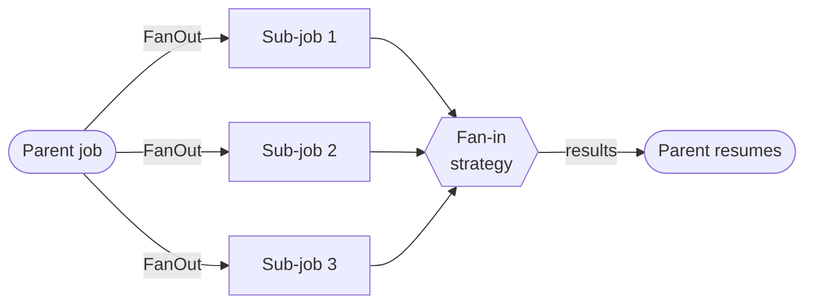

Complete, copy-paste-runnable code examples for common use cases. Jump to what you need:


  
  
  
  
  
  
  
  
  
  
  
  
  
  
  


## Basic Job Processing

Simple fire-and-forget job processing.

```go
package main

import (
    "context"
    "fmt"
    "time"

    jobs "github.com/jdziat/simple-durable-jobs/v4"
    "gorm.io/driver/sqlite"
    "gorm.io/gorm"
)

func main() {
    // Setup
    db, _ := gorm.Open(sqlite.Open(jobs.SafeSQLiteDSN("jobs.db")), &gorm.Config{})
    storage := jobs.NewGormStorage(db)
    storage.Migrate(context.Background())
    queue := jobs.New(storage)

    // Register handler
    queue.Register("send-email", func(ctx context.Context, args EmailArgs) error {
        fmt.Printf("Sending email to %s: %s\n", args.To, args.Subject)
        return nil
    })

    // Enqueue jobs
    ctx := context.Background()
    queue.Enqueue(ctx, "send-email", EmailArgs{To: "user@example.com", Subject: "Hello"})
    queue.Enqueue(ctx, "send-email", EmailArgs{To: "admin@example.com", Subject: "Report"},
        jobs.Priority(100)) // High priority

    // Start worker
    worker := queue.NewWorker()
    worker.Start(ctx)
}

type EmailArgs struct {
    To      string `json:"to"`
    Subject string `json:"subject"`
}
```

[View full example](https://github.com/jdziat/simple-durable-jobs/tree/main/examples/basic)

---

## Typed API

Typed definitions keep the existing string-keyed routing model while giving Go
producers compile-time checked arguments and results.

```go
import typed "github.com/jdziat/simple-durable-jobs/v4/pkg/typed"

sendEmail := typed.Define(queue, "send-email", func(ctx context.Context, args EmailArgs) (EmailResult, error) {
    return EmailResult{MessageID: "msg_123"}, nil
})

jobID, err := sendEmail.Enqueue(ctx, EmailArgs{To: "user@example.com"})
if err != nil {
    panic(err)
}

result, err := sendEmail.Load(ctx, jobID)
_ = result
```

[View typed basic example](https://github.com/jdziat/simple-durable-jobs/tree/main/examples/typed/basic)

[View typed workflow example](https://github.com/jdziat/simple-durable-jobs/tree/main/examples/typed/workflow)

---

## Durable Workflows

Multi-step workflows with automatic checkpointing and crash recovery.

```go
package main

import (
    "context"
    "fmt"

    jobs "github.com/jdziat/simple-durable-jobs/v4"
    "gorm.io/driver/sqlite"
    "gorm.io/gorm"
)

func main() {
    db, _ := gorm.Open(sqlite.Open(jobs.SafeSQLiteDSN("workflow.db")), &gorm.Config{})
    storage := jobs.NewGormStorage(db)
    storage.Migrate(context.Background())
    queue := jobs.New(storage)

    // Register step handlers
    queue.Register("validate-order", func(ctx context.Context, order Order) (Order, error) {
        fmt.Println("Validating order...")
        order.Status = "validated"
        return order, nil
    })

    queue.Register("charge-payment", func(ctx context.Context, order Order) (string, error) {
        fmt.Println("Charging payment...")
        return "receipt-123", nil
    })

    queue.Register("ship-order", func(ctx context.Context, receipt string) error {
        fmt.Println("Shipping order...")
        return nil
    })

    // Register workflow
    queue.Register("process-order", func(ctx context.Context, order Order) error {
        // Each Call is checkpointed. On crash/retry, completed steps
        // return cached results without re-executing.

        validated, err := jobs.Call[Order](ctx, "validate-order", order)
        if err != nil {
            return err
        }

        receipt, err := jobs.Call[string](ctx, "charge-payment", validated)
        if err != nil {
            return err
        }

        _, err = jobs.Call[any](ctx, "ship-order", receipt)
        return err
    })

    // Enqueue and process
    ctx := context.Background()
    queue.Enqueue(ctx, "process-order", Order{ID: "ORD-001", Total: 99.99},
        jobs.Retries(5))

    worker := queue.NewWorker()
    worker.Start(ctx)
}

type Order struct {
    ID     string  `json:"id"`
    Total  float64 `json:"total"`
    Status string  `json:"status"`
}
```

[View full example](https://github.com/jdziat/simple-durable-jobs/tree/main/examples/workflow)

---

## Fan-Out/Fan-In

Process items in parallel using sub-jobs, then aggregate results. A parent job spawns N children, the worker runs them in parallel, and the parent resumes once the chosen strategy (`fail_fast`, `collect_all`, or `threshold`) is satisfied:



```go
package main

import (
    "context"
    "fmt"

    jobs "github.com/jdziat/simple-durable-jobs/v4"
    "gorm.io/driver/sqlite"
    "gorm.io/gorm"
)

func main() {
    db, _ := gorm.Open(sqlite.Open(jobs.SafeSQLiteDSN("fanout.db")), &gorm.Config{})
    storage := jobs.NewGormStorage(db)
    storage.Migrate(context.Background())
    queue := jobs.New(storage)

    // Register sub-job handler
    queue.Register("process-image", func(ctx context.Context, img Image) (Result, error) {
        fmt.Printf("Processing image: %s\n", img.URL)
        return Result{ImageID: img.ID, Thumbnail: img.URL + "/thumb"}, nil
    })

    // Register parent job that fans out
    queue.Register("batch-process-images", func(ctx context.Context, images []Image) error {
        // Create sub-jobs for each image
        subJobs := make([]jobs.SubJob, len(images))
        for i, img := range images {
            subJobs[i] = jobs.Sub("process-image", img)
        }

        // Fan-out: spawn all sub-jobs in parallel, wait for results
        results, err := jobs.FanOut[Result](ctx, subJobs,
            jobs.FailFast(),                    // Stop on first failure
            jobs.WithFanOutQueue("batch"),      // Run on batch queue
            jobs.WithFanOutRetries(3),          // Retry failed sub-jobs
        )
        if err != nil {
            return err
        }

        // Aggregate successful results
        thumbnails := jobs.Values(results)
        fmt.Printf("Generated %d thumbnails\n", len(thumbnails))
        return nil
    })

    ctx := context.Background()
    queue.Enqueue(ctx, "batch-process-images", []Image{
        {ID: "1", URL: "https://example.com/image1.jpg"},
        {ID: "2", URL: "https://example.com/image2.jpg"},
        {ID: "3", URL: "https://example.com/image3.jpg"},
    })

    worker := queue.NewWorker(
        jobs.WorkerQueue("default", jobs.Concurrency(5)),
        jobs.WorkerQueue("batch", jobs.Concurrency(10)),
    )
    worker.Start(ctx)
}

type Image struct {
    ID  string `json:"id"`
    URL string `json:"url"`
}

type Result struct {
    ImageID   string `json:"image_id"`
    Thumbnail string `json:"thumbnail"`
}
```

### Fan-Out Strategies

```go
// FailFast: Stop on first sub-job failure (default)
results, err := jobs.FanOut[T](ctx, subJobs, jobs.FailFast())

// CollectAll: Wait for all sub-jobs, return partial results
results, err := jobs.FanOut[T](ctx, subJobs, jobs.CollectAll())

// Threshold: Succeed if at least 80% of sub-jobs complete
results, err := jobs.FanOut[T](ctx, subJobs, jobs.Threshold(0.8))
```

### Working with Results

```go
results, _ := jobs.FanOut[T](ctx, subJobs, jobs.CollectAll())

// Extract all successful values
values := jobs.Values(results)

// Split into successes and failures
successes, failures := jobs.Partition(results)

// Check if all succeeded
if jobs.AllSucceeded(results) {
    fmt.Println("All sub-jobs completed successfully")
}

// Access individual results
for _, r := range results {
    if r.Err != nil {
        fmt.Printf("Sub-job %d failed: %v\n", r.Index, r.Err)
    } else {
        fmt.Printf("Sub-job %d result: %v\n", r.Index, r.Value)
    }
}
```

---

## Scheduled Jobs

Recurring jobs with various schedule types.

```go
package main

import (
    "context"
    "fmt"
    "time"

    jobs "github.com/jdziat/simple-durable-jobs/v4"
    "gorm.io/driver/sqlite"
    "gorm.io/gorm"
)

func main() {
    db, _ := gorm.Open(sqlite.Open(jobs.SafeSQLiteDSN("scheduled.db")), &gorm.Config{})
    storage := jobs.NewGormStorage(db)
    storage.Migrate(context.Background())
    queue := jobs.New(storage)

    // Register handlers
    queue.Register("health-check", func(ctx context.Context, _ struct{}) error {
        fmt.Printf("[%s] Health check: OK\n", time.Now().Format("15:04:05"))
        return nil
    })

    queue.Register("daily-report", func(ctx context.Context, _ struct{}) error {
        fmt.Println("Generating daily report...")
        return nil
    })

    queue.Register("weekly-backup", func(ctx context.Context, _ struct{}) error {
        fmt.Println("Running weekly backup...")
        return nil
    })
    queue.Register("hourly-task", func(ctx context.Context, _ struct{}) error {
        fmt.Println("Running hourly task...")
        return nil
    })

    // Schedule jobs
    if err := queue.Schedule("health-check", nil, jobs.Every(1*time.Minute)); err != nil {
        panic(err)
    }
    if err := queue.Schedule("daily-report", nil, jobs.Daily(9, 0)); err != nil { // 9:00 AM UTC
        panic(err)
    }
    if err := queue.Schedule("weekly-backup", nil, jobs.Weekly(time.Sunday, 2, 0)); err != nil { // Sunday 2:00 AM
        panic(err)
    }

    // Cron expression: every hour at minute 0
    if err := queue.Schedule("hourly-task", nil, jobs.Cron("0 * * * *")); err != nil {
        panic(err)
    }

    // Start worker with scheduler enabled
    worker := queue.NewWorker(jobs.WithScheduler(true))
    worker.Start(context.Background())
}
```

[View full example](https://github.com/jdziat/simple-durable-jobs/tree/main/examples/scheduled)

---

## Priority Queues

Process high-priority jobs first.

```go
package main

import (
    "context"
    "fmt"

    jobs "github.com/jdziat/simple-durable-jobs/v4"
    "gorm.io/driver/sqlite"
    "gorm.io/gorm"
)

func main() {
    db, _ := gorm.Open(sqlite.Open(jobs.SafeSQLiteDSN("priority.db")), &gorm.Config{})
    storage := jobs.NewGormStorage(db)
    storage.Migrate(context.Background())
    queue := jobs.New(storage)

    queue.Register("task", func(ctx context.Context, name string) error {
        fmt.Printf("Processing: %s\n", name)
        return nil
    })

    ctx := context.Background()

    // Enqueue with different priorities
    queue.Enqueue(ctx, "task", "low-priority-1", jobs.Priority(1))
    queue.Enqueue(ctx, "task", "low-priority-2", jobs.Priority(1))
    queue.Enqueue(ctx, "task", "URGENT", jobs.Priority(100))      // Runs first
    queue.Enqueue(ctx, "task", "medium", jobs.Priority(50))
    queue.Enqueue(ctx, "task", "CRITICAL", jobs.Priority(1000))   // Runs first

    // Single worker to demonstrate ordering
    worker := queue.NewWorker(jobs.WorkerQueue("default", jobs.Concurrency(1)))
    worker.Start(ctx)
}
```

---

## Error Handling

Control retry behavior with custom error types.

```go
package main

import (
    "context"
    "errors"
    "time"

    jobs "github.com/jdziat/simple-durable-jobs/v4"
    "gorm.io/driver/sqlite"
    "gorm.io/gorm"
)

func main() {
    db, _ := gorm.Open(sqlite.Open(jobs.SafeSQLiteDSN("errors.db")), &gorm.Config{})
    storage := jobs.NewGormStorage(db)
    storage.Migrate(context.Background())
    queue := jobs.New(storage)

    queue.Register("api-call", func(ctx context.Context, endpoint string) error {
        // Simulate different error scenarios

        // Permanent failure - don't retry
        if endpoint == "/invalid" {
            return jobs.NoRetry(errors.New("invalid endpoint"))
        }

        // Rate limited - retry after delay
        if endpoint == "/rate-limited" {
            return jobs.RetryAfter(5*time.Minute, errors.New("rate limited"))
        }

        // Temporary failure - use default retry with backoff
        if endpoint == "/flaky" {
            return errors.New("temporary network error")
        }

        return nil
    })

    ctx := context.Background()
    queue.Enqueue(ctx, "api-call", "/invalid", jobs.Retries(3))
    queue.Enqueue(ctx, "api-call", "/rate-limited", jobs.Retries(3))
    queue.Enqueue(ctx, "api-call", "/flaky", jobs.Retries(3))

    worker := queue.NewWorker()
    worker.Start(ctx)
}
```

---

## Observability

Monitor job execution with hooks and events.

```go
package main

import (
    "context"
    "log"

    jobs "github.com/jdziat/simple-durable-jobs/v4"
    "gorm.io/driver/sqlite"
    "gorm.io/gorm"
)

func main() {
    db, _ := gorm.Open(sqlite.Open(jobs.SafeSQLiteDSN("observe.db")), &gorm.Config{})
    storage := jobs.NewGormStorage(db)
    storage.Migrate(context.Background())
    queue := jobs.New(storage)

    // Register hooks
    queue.OnJobStart(func(ctx context.Context, job *jobs.Job) {
        log.Printf("[START] %s (%s)", job.ID[:8], job.Type)
    })

    queue.OnJobComplete(func(ctx context.Context, job *jobs.Job) {
        duration := job.CompletedAt.Sub(*job.StartedAt)
        log.Printf("[DONE] %s completed in %v", job.ID[:8], duration)
    })

    queue.OnJobFail(func(ctx context.Context, job *jobs.Job, err error) {
        log.Printf("[FAIL] %s: %v", job.ID[:8], err)
    })

    queue.OnRetry(func(ctx context.Context, job *jobs.Job, attempt int, err error) {
        log.Printf("[RETRY] %s attempt %d: %v", job.ID[:8], attempt, err)
    })

    // Or use event stream for async processing
    events := queue.Events()
    go func() {
        for event := range events {
            switch e := event.(type) {
            case *jobs.JobStarted:
                // Send to metrics system
            case *jobs.JobCompleted:
                // Update dashboard
            case *jobs.JobFailed:
                // Alert on-call
            }
        }
    }()

    // ... register handlers and start worker
}
```

---

## Distributed Workers

Run multiple workers for horizontal scaling.

```go
package main

import (
    "context"
    "flag"
    "fmt"

    jobs "github.com/jdziat/simple-durable-jobs/v4"
    "gorm.io/driver/postgres"
    "gorm.io/gorm"
)

func main() {
    workerID := flag.String("id", "worker-1", "Worker ID")
    flag.Parse()

    // Use PostgreSQL for production distributed systems
    dsn := "host=localhost user=app dbname=jobs"
    db, _ := gorm.Open(postgres.Open(dsn), &gorm.Config{})

    storage := jobs.NewGormStorage(db)
    storage.Migrate(context.Background())
    queue := jobs.New(storage)

    queue.Register("task", func(ctx context.Context, id int) error {
        fmt.Printf("[%s] Processing task %d\n", *workerID, id)
        return nil
    })

    // Each worker processes jobs independently
    // Jobs are locked to prevent duplicate processing
    worker := queue.NewWorker(
        jobs.WorkerQueue("default", jobs.Concurrency(5)),
    )

    fmt.Printf("[%s] Starting...\n", *workerID)
    worker.Start(context.Background())
}
```

Run multiple instances:

```bash
./app -id worker-1 &
./app -id worker-2 &
./app -id worker-3 &
```

[View full example](https://github.com/jdziat/simple-durable-jobs/tree/main/examples/distributed)

---

## Pause/Resume

Control job execution at the worker, queue, and individual job level.

```go
// Graceful pause: finish running jobs, stop picking new ones
worker.Pause(jobs.PauseModeGraceful)

// Wait for all running jobs to complete (with timeout)
if err := worker.WaitForPause(30 * time.Second); err != nil {
    log.Printf("Timeout waiting for jobs: %v", err)
}

worker.Resume()

// Aggressive pause: cancel running jobs immediately
worker.Pause(jobs.PauseModeAggressive)

// Cancel a specific running job
cancelled := worker.CancelJob(jobID)

// Pause/resume at queue level
queue.PauseQueue(ctx, "emails")
queue.ResumeQueue(ctx, "emails")

// Pause/resume pending or waiting jobs
queue.PauseJob(ctx, jobID)
queue.ResumeJob(ctx, jobID)
```

---

## Embedded Web UI

Mount a full-featured monitoring dashboard into any Go HTTP server.

```go
import "github.com/jdziat/simple-durable-jobs/v4/ui"

ctx, cancel := context.WithCancel(context.Background())
defer cancel()

mux := http.NewServeMux()
mux.Handle("/jobs/", http.StripPrefix("/jobs", ui.Handler(storage,
    ui.WithQueue(queue),                       // Enable event streaming and scheduled jobs
    ui.WithContext(ctx),                        // Graceful shutdown for background workers
    ui.WithStatsRetention(7 * 24 * time.Hour), // Keep stats for 7 days
    ui.WithInsecureAllowUnauthenticated(),     // Local/trusted networks only
    ui.WithMiddleware(func(next http.Handler) http.Handler {
        return http.HandlerFunc(func(w http.ResponseWriter, r *http.Request) {
            // Add logging, compression, or other HTTP middleware here.
            next.ServeHTTP(w, r)
        })
    }),
)))

log.Fatal(http.ListenAndServe(":8080", mux))
```

The dashboard fails closed by default: without `ui.WithAuthorizer(...)` or `ui.WithInsecureAllowUnauthenticated()`, all dashboard RPCs (reads and mutations) return `PermissionDenied`. This is an authorization gate only — it does not provide transport encryption, CSRF protection, or audit logging; operate the dashboard behind your own TLS and network controls.

---

## Connection Pool Configuration

Tune database connection pooling for your workload.

```go
// Use a preset for high-concurrency workloads
storage, err := jobs.NewGormStorageWithPool(db, jobs.HighConcurrencyPoolConfig())

// Or customize individual pool settings
storage, err := jobs.NewGormStorageWithPool(db,
    jobs.MaxOpenConns(50),
    jobs.MaxIdleConns(20),
    jobs.ConnMaxLifetime(10 * time.Minute),
    jobs.ConnMaxIdleTime(2 * time.Minute),
)
```

---

## Durable Signals

Human-in-the-loop workflow approval with durable signals.

```go
queue.Register("approval-workflow", func(ctx context.Context, req ApprovalRequest) error {
	packet, err := jobs.Call[ApprovalPacket](ctx, "prepare-request", req)
	if err != nil {
		return err
	}

	approval, ok, err := jobs.WaitForSignalTimeout[Approval](ctx, "approval", 30*time.Minute)
	if err != nil {
		return err
	}
	if !ok {
		return jobs.NoRetry(fmt.Errorf("approval timed out for %s", packet.RequestID))
	}

	return applyApproval(ctx, packet, approval)
})

jobID, err := queue.Enqueue(ctx, "approval-workflow", ApprovalRequest{ID: "REQ-1001"})
if err != nil {
	return err
}

err = queue.Signal(ctx, jobID, "approval", Approval{
	ApprovedBy: "alice@example.com",
})
```

[View full example](https://github.com/jdziat/simple-durable-jobs/tree/main/examples/signals)

---

## Transactional Enqueue

Write application data and enqueue follow-up work in the same database transaction.

```go
tx := db.Begin()
defer tx.Rollback()

order := Order{ID: "ORD-1001", Status: "pending"}
if err := tx.WithContext(ctx).Create(&order).Error; err != nil {
	return err
}

jobID, err := queue.EnqueueTx(ctx, tx, "fulfill-order", FulfillOrderArgs{
	OrderID: order.ID,
}, jobs.Unique("fulfill:"+order.ID))
if err != nil {
	return err
}

if err := tx.Commit().Error; err != nil {
	return err
}
log.Printf("committed order and job %s", jobID)
```

[View full example](https://github.com/jdziat/simple-durable-jobs/tree/main/examples/transactional-enqueue)

---

## Durable Agent

A durable AI-agent-shaped workflow with mocked model calls, checkpointed steps, durable sleeps, and human approval before action.

```go
queue.Register("agent-workflow", func(ctx context.Context, task AgentTask) error {
	observations := make([]string, 0, 3)
	for i := 0; i < 3; i++ {
		result, err := jobs.Call[LLMResult](ctx, "mock-llm", LLMRequest{
			TaskID:    task.ID,
			Iteration: i,
		})
		if err != nil {
			return err
		}
		observations = append(observations, result.Observation)
		if err := jobs.Sleep(ctx, 2*time.Second); err != nil {
			return err
		}
	}

	if _, _, err := jobs.WaitForSignalTimeout[Approval](ctx, "approval", time.Hour); err != nil {
		return err
	}
	_, err := jobs.Call[any](ctx, "act-on-plan", FinalPlan{TaskID: task.ID, Observations: observations})
	return err
})
```

[View full example](https://github.com/jdziat/simple-durable-jobs/tree/main/examples/agent)

---

## Metrics

Optional Prometheus/OpenTelemetry metrics for queue depth, lifecycle counters, and duration histograms.

```go
import jobsmetrics "github.com/jdziat/simple-durable-jobs/v4/pkg/metrics"

handler, meterProvider, err := jobsmetrics.NewPrometheusHandler()
if err != nil {
	return err
}
defer func() {
	_ = meterProvider.Shutdown(ctx)
}()

jobsmetrics.Instrument(queue, jobsmetrics.WithMeterProvider(meterProvider))

mux.Handle("/metrics", handler)
```

[View full example](https://github.com/jdziat/simple-durable-jobs/tree/main/examples/metrics)

---

## Rate Limits and Caps

Throttle one queue locally and cap in-flight work per tenant across the fleet.

```go
func tenantFromJob(job *jobs.Job) string {
	var args LimitedWorkArgs
	if err := json.Unmarshal(job.Args, &args); err != nil || args.Tenant == "" {
		return "unknown"
	}
	return args.Tenant
}

worker := queue.NewWorker(
	jobs.WorkerQueue("limited", jobs.Concurrency(6)),
	jobs.WithQueueRateLimit("limited", 3, 1),
	jobs.ConcurrencyCap("tenant-work", 2, jobs.CapKey(tenantFromJob)),
	jobs.WithPollInterval(50*time.Millisecond),
)
```

[View full example](https://github.com/jdziat/simple-durable-jobs/tree/main/examples/ratelimit)

---

## More Examples

Find complete runnable examples in the [examples directory](https://github.com/jdziat/simple-durable-jobs/tree/main/examples).
