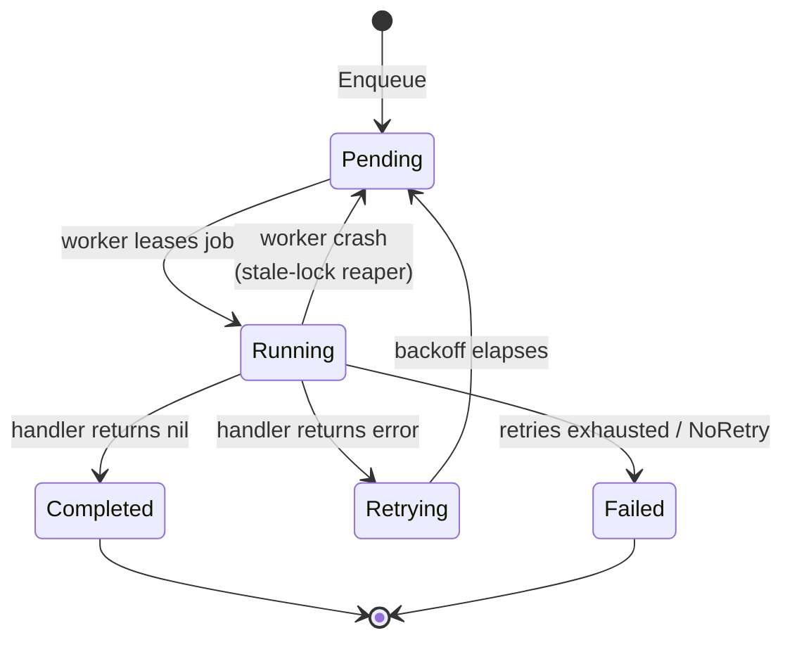

This guide walks you through setting up Simple Durable Jobs in your Go application.

## How a job flows

Every job moves through the same lifecycle. You enqueue work; a worker leases it, runs your handler, and the result is recorded durably. Failures are retried with backoff until they succeed or exhaust their attempts — and if a worker crashes mid-run, the stale-lock reaper returns the job to the queue so another worker can pick it up.



## Installation

```bash
go get github.com/jdziat/simple-durable-jobs/v3
```

You'll also need a database driver. For development, SQLite works great:

```bash
go get gorm.io/driver/sqlite
```

For production, PostgreSQL is recommended:

```bash
go get gorm.io/driver/postgres
```

## Basic Setup

### 1. Create Storage and Queue

```go
package main

import (
    "context"

    jobs "github.com/jdziat/simple-durable-jobs/v3"
    "gorm.io/driver/sqlite"
    "gorm.io/gorm"
)

func main() {
    // Open database connection. SafeSQLiteDSN adds the SQLite parameters
    // required for safe concurrent workers (see the SQLite concurrency note below).
    db, err := gorm.Open(sqlite.Open(jobs.SafeSQLiteDSN("jobs.db")), &gorm.Config{})
    if err != nil {
        panic(err)
    }

    // Create storage layer
    storage := jobs.NewGormStorage(db)

    // Run migrations to create tables
    if err := storage.Migrate(context.Background()); err != nil {
        panic(err)
    }

    // Create the queue
    queue := jobs.New(storage)
}
```


**SQLite concurrency.** Always open SQLite with `?_journal_mode=WAL&_busy_timeout=5000&_txlock=immediate`.
SQLite allows only one writer at a time; with a bare DSN (rollback-journal mode, no busy timeout)
concurrent workers race the writer lock and completion writes can transiently fail with
`SQLITE_BUSY` ("database is locked") or `SQLITE_READONLY` ("attempt to write a readonly database"),
which can leave a job unmarked as completed. WAL plus a busy timeout (applied to every pooled
connection via the DSN) and immediate transactions make writers wait and serialize cleanly.
For heavy multi-process concurrency, use PostgreSQL or MySQL.


### 2. Register Job Handlers

Job handlers are functions that process jobs. They receive a context and typed arguments:

```go
// Handler with struct arguments
type SendEmailArgs struct {
    To      string `json:"to"`
    Subject string `json:"subject"`
    Body    string `json:"body"`
}

queue.Register("send-email", func(ctx context.Context, args SendEmailArgs) error {
    // Send the email...
    fmt.Printf("Sending email to %s: %s\n", args.To, args.Subject)
    return nil
})

// Handler with primitive arguments
queue.Register("process-number", func(ctx context.Context, n int) error {
    fmt.Printf("Processing: %d\n", n)
    return nil
})

// Handler that returns a value (for use with Call)
queue.Register("calculate", func(ctx context.Context, x int) (int, error) {
    return x * 2, nil
})
```

The string-keyed `Register` path is still useful for remote producers, dynamic job names, and interoperability with non-Go systems. For compile-time checked producer code, use the typed API:

```go
import typed "github.com/jdziat/simple-durable-jobs/v3/pkg/typed"

type SendEmailResult struct {
    MessageID string `json:"message_id"`
}

sendEmail := typed.Define(queue, "send-email", func(ctx context.Context, args SendEmailArgs) (SendEmailResult, error) {
    fmt.Printf("Sending email to %s\n", args.To)
    return SendEmailResult{MessageID: "msg_123"}, nil
})

cleanup := typed.DefineVoid(queue, "cleanup", func(ctx context.Context, _ struct{}) error {
    fmt.Println("Cleaning up")
    return nil
})

// Producer-only process: create a typed handle without registering a local handler.
remoteSendEmail := typed.Declare[SendEmailArgs, SendEmailResult](queue, "send-email")

jobID, err := sendEmail.Enqueue(ctx, SendEmailArgs{To: "user@example.com"})
if err != nil {
    return err
}

// Inside another job handler, Call runs the job as a checkpointed nested step.
result, err := sendEmail.Call(ctx, SendEmailArgs{To: "user@example.com"})

// Outside the handler, Load decodes the persisted result for a completed job.
loaded, err := sendEmail.Load(ctx, jobID)

_, err = cleanup.Enqueue(ctx, struct{}{})
_, err = remoteSendEmail.EnqueueRemote(ctx, SendEmailArgs{To: "remote@example.com"})
_ = result
_ = loaded
```

### 3. Enqueue Jobs

```go
ctx := context.Background()

// Basic enqueue
jobID, err := queue.Enqueue(ctx, "send-email", SendEmailArgs{
    To:      "user@example.com",
    Subject: "Welcome!",
    Body:    "Thanks for signing up.",
})

// With options
jobID, err = queue.Enqueue(ctx, "send-email", args,
    jobs.Priority(100),           // Higher runs first
    jobs.Retries(5),              // Retry up to 5 times
    jobs.Delay(time.Minute),      // Wait 1 minute before running
    jobs.QueueOpt("emails"),      // Use specific queue
)
```

### 4. Start a Worker

```go
// Create and start worker
worker := queue.NewWorker()
worker.Start(ctx) // Blocks until context is cancelled
```

For graceful shutdown:

```go
ctx, cancel := context.WithCancel(context.Background())

// Start worker in goroutine
go worker.Start(ctx)

// On shutdown signal
cancel()
```

## Worker Configuration

Configure worker concurrency and queues:

```go
worker := queue.NewWorker(
    // Process "default" queue with 10 concurrent workers
    jobs.WorkerQueue("default", jobs.Concurrency(10)),

    // Process "emails" queue with 5 concurrent workers
    jobs.WorkerQueue("emails", jobs.Concurrency(5)),

    // Enable the scheduler for recurring jobs
    jobs.WithScheduler(true),
)
```

Workers also run retention GC by default: completed jobs are kept for 30 days,
failed and cancelled jobs for 90 days, and consumed signals for 7 days. Use
`jobs.RetentionDisabled()` only when you manage retention outside the worker.


When `Concurrency()` is used inside `WorkerQueue()`, it applies only to that queue. Each queue independently tracks how many jobs it has running and only dequeues more when below its limit.


## Durable Workflows

For multi-step workflows, use `jobs.Call` to create checkpoints:

```go
queue.Register("process-order", func(ctx context.Context, order Order) error {
    // Step 1: Validate (checkpointed)
    validated, err := jobs.Call[Order](ctx, "validate", order)
    if err != nil {
        return err
    }

    // Step 2: Charge payment (checkpointed)
    // If this fails, step 1 won't re-run on retry
    receipt, err := jobs.Call[string](ctx, "charge", validated.Total)
    if err != nil {
        return err
    }

    // Step 3: Ship (checkpointed)
    _, err = jobs.Call[any](ctx, "ship", validated.Items)
    return err
})
```

## Scheduled Jobs

Set up recurring jobs:

```go
// Every 5 minutes
queue.Schedule("cleanup", nil, jobs.Every(5 * time.Minute))

// Daily at 9:00 AM
queue.Schedule("report", nil, jobs.Daily(9, 0))

// Weekly on Sunday at 2:00 AM
queue.Schedule("backup", nil, jobs.Weekly(time.Sunday, 2, 0))

// Cron expression
queue.Schedule("hourly", nil, jobs.Cron("0 * * * *"))

// Remember to enable scheduler in worker
worker := queue.NewWorker(jobs.WithScheduler(true))
```

## Observability

Add hooks to monitor job execution:

```go
queue.OnJobStart(func(ctx context.Context, job *jobs.Job) {
    log.Printf("Job %s started", job.ID)
})

queue.OnJobComplete(func(ctx context.Context, job *jobs.Job) {
    log.Printf("Job %s completed in %v", job.ID, job.CompletedAt.Sub(*job.StartedAt))
})

queue.OnJobFail(func(ctx context.Context, job *jobs.Job, err error) {
    log.Printf("Job %s failed: %v", job.ID, err)
})

queue.OnRetry(func(ctx context.Context, job *jobs.Job, attempt int, err error) {
    log.Printf("Job %s retrying (attempt %d): %v", job.ID, attempt, err)
})

// Event stream (remember to unsubscribe to prevent leaks)
events := queue.Events()
defer queue.Unsubscribe(events)
```

## Pause/Resume

Pause and resume at the job, queue, or worker level:

```go
// Pause a pending or waiting job
queue.PauseJob(ctx, jobID)
queue.ResumeJob(ctx, jobID)

// Pause an entire queue
queue.PauseQueue(ctx, "emails")
queue.ResumeQueue(ctx, "emails")

// Pause a worker (graceful: finish running jobs, stop picking new ones)
worker.Pause(jobs.PauseModeGraceful)
worker.Resume()

// Aggressive: cancel running jobs immediately
worker.Pause(jobs.PauseModeAggressive)
```

## Embedded Web UI

Mount a monitoring dashboard into your HTTP server:

```go
import "github.com/jdziat/simple-durable-jobs/v3/ui"

ctx, cancel := context.WithCancel(context.Background())
defer cancel()

mux.Handle("/jobs/", http.StripPrefix("/jobs", ui.Handler(storage,
    ui.WithQueue(queue),                         // Enable event streaming
    ui.WithContext(ctx),                         // Lifecycle context for graceful shutdown
    ui.WithInsecureAllowUnauthenticated(),       // Local/trusted networks only
)))
```

The dashboard fails closed by default: without `ui.WithAuthorizer(...)` or `ui.WithInsecureAllowUnauthenticated()`, all dashboard RPCs (reads and mutations) return `PermissionDenied`. This is an authorization gate only — it does not provide transport encryption, CSRF protection, or audit logging; operate the dashboard behind your own TLS and network controls.

The dashboard shows real-time queue stats, historical charts, live event streaming, and job management controls.

## Error Handling

Control retry behavior with special error types:

```go
// Don't retry this job
return jobs.NoRetry(errors.New("invalid input"))

// Retry after specific duration
return jobs.RetryAfter(5 * time.Minute, errors.New("rate limited"))
```

## Production Setup

For production, use PostgreSQL:

```go
import "gorm.io/driver/postgres"

dsn := "host=localhost user=app password=secret dbname=jobs"
db, err := gorm.Open(postgres.Open(dsn), &gorm.Config{})
```

Run multiple workers for horizontal scaling:

```bash
# Terminal 1
./myapp -worker

# Terminal 2
./myapp -worker

# Terminal 3
./myapp -worker
```

Each worker will process jobs from the queue without duplicates.

### Hardening for production

Two knobs matter most once you're running multiple workers against a shared database. Both have sensible defaults, so reach for them when you're tuning — the dedicated pages cover the trade-offs in depth:


  
  


## Next Steps

- [API Reference](../api-reference/) - Complete API documentation
- [Examples](../examples/) - More code examples
- [Embedded Web UI](../embedded-ui/) - Dashboard setup and configuration
- [Live Demo](../live-demo/) - The dashboard running on simulated data
- [Advanced Topics](../advanced/) - Transactional enqueue, dead-letter queue, retention/GC, rate limiting, concurrency caps, metrics, workflow versioning, payload codec, authorization, testing utilities, and tuning knobs
- [GitHub](https://github.com/jdziat/simple-durable-jobs) - Source code and issues
